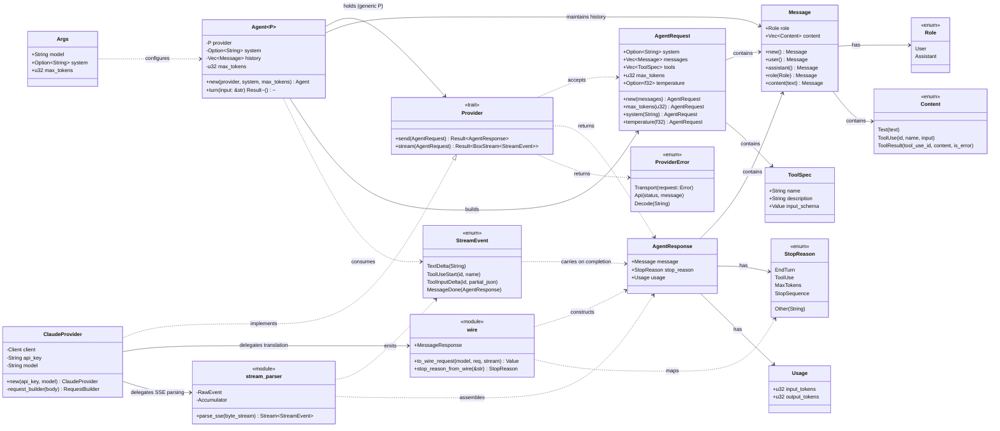

# banks — crate architecture

Class diagram of the `banks` crate. `Provider` is the model-neutral
trait; `ClaudeProvider` is the only implementation, translating to and
from Anthropic's Messages API wire format via `wire.rs` and `stream.rs`.

## Sequence: one CLI turn

Runtime flow for a single user input, from the REPL prompt through the
Claude SSE stream and back to stdout. Reflects the actual loop in
`agent.rs` and the event handling in `stream.rs`.

```mermaid
sequenceDiagram
    actor User
    participant Main as main.rs (REPL)
    participant Agent
    participant Claude as ClaudeProvider
    participant Wire as wire.rs
    participant API as Claude Messages API
    participant SSE as stream.rs (parse_sse)

    User->>Main: types a line, presses enter
    Main->>Agent: turn(input)
    Agent->>Agent: history.push(Message::user(input))
    Agent->>Agent: build AgentRequest (history, max_tokens, system)
    Agent->>Claude: stream(request)
    Claude->>Wire: to_wire_request(model, request, stream=true)
    Wire-->>Claude: JSON body
    Claude->>API: POST /v1/messages (x-api-key, anthropic-version)
    API-->>Claude: 200 + text/event-stream

    Claude->>SSE: parse_sse(byte_stream)
    SSE-->>Claude: BoxStream<StreamEvent>
    Claude-->>Agent: BoxStream<StreamEvent>

    loop for each SSE event
        API->>SSE: content_block_start / content_block_delta
        SSE->>SSE: accumulate into Accumulator
        SSE-->>Agent: StreamEvent::TextDelta(chunk)
        Agent->>User: write chunk to stdout, flush
    end

    alt assistant requests a tool
        API->>SSE: content_block_start (tool_use)
        SSE-->>Agent: StreamEvent::ToolUseStart { id, name }
        Agent->>User: stderr: "[tool requested: name — not yet supported]"
    end

    API->>SSE: message_stop
    SSE-->>Agent: StreamEvent::MessageDone(AgentResponse)
    Agent->>Agent: history.push(response.message)
    Agent-->>Main: Ok(())
    Main->>User: print "> " prompt, await next line
```

## Notes

- **Trait boundary** — `Provider` is the only abstraction point. `Agent
`
  is generic over `P: Provider` and never references `ClaudeProvider`
  directly; a second provider means a new impl, not agent-loop changes.
- **Neutral vs. wire types** — `types.rs` holds the provider-agnostic model
  (`Message`, `Content`, ...). `wire.rs` and `stream.rs` are Claude-only,
  translating Anthropic's JSON/SSE shapes into that neutral model.
- **Unused today** — `ToolUse`, `ToolResult`, `ToolSpec` are modeled but not
  wired up; no tool execution exists yet.
- **Builder pattern** — `Message` and `AgentRequest` use consuming builder
  methods (`.user()`, `.content()`, `.max_tokens()`) rather than public
  struct-literal construction.
- **Streaming, not polling** — the sequence diagram above shows the actual
  turn: `stream()` returns a `BoxStream` immediately after the HTTP headers
  arrive, and `parse_sse` yields `StreamEvent`s incrementally as SSE frames
  arrive, rather than buffering the full response.
